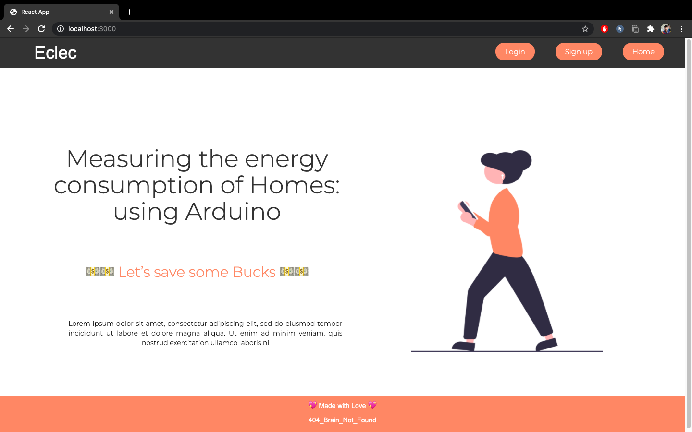

 
  
  
  
  # Eclec     

  A web-app to measure up your power usage as well as save some bucks..

  # Theme 

  Smart power-grid management system
 
   # Overview
 
  It is basically a website having some computational power to provide users with information regarding their household energy demands.

  # Inputs by the user
  
  All appliances with their horse power/power consumption figure(watt may be used)  and (min to max) timing of using that appliance every day. So to maintain the average house hold power consumption it will tell user the way to use the appliances.

  # Output by the website

  It is the time allotted for each equipment to get utilized so that power consumption at the month end is predictable or don’t deviate largely from the average.. 

 # Key takeaways

  Average household power may be calculated by previous electricity bill. Basically our website will tell users how much electricity a particular equipment will be able to use  based upon the bill he wants at the month end .

  We can also attach the current measurer with each electronic device so that if user uses more electricity than specified he/she will get an alert of using excess electricity .

  We can also add features in which user’s family will get ranked in their colony on the basis of minimum household energy consumption they may be rewarded(by government) for their prime indeed.

  Extended to this idea if the whole colony start using this website then we may provide this data to electricity supplier to maintain the demand of electricity supply after considering  the colony household needs. 

## License

[HACK](https://www.hackerearth.com/challenges/hackathon/)
