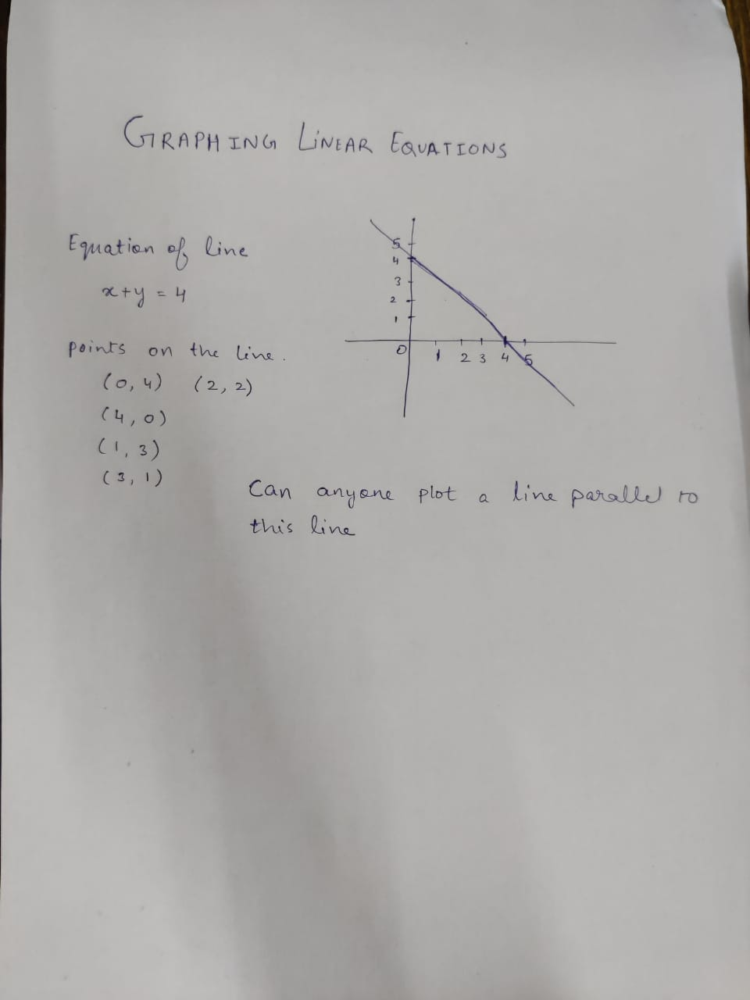
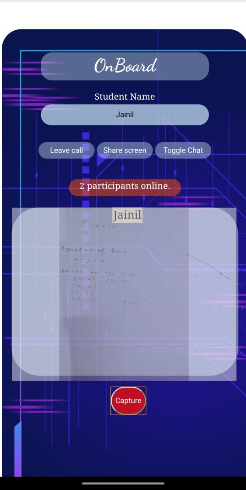
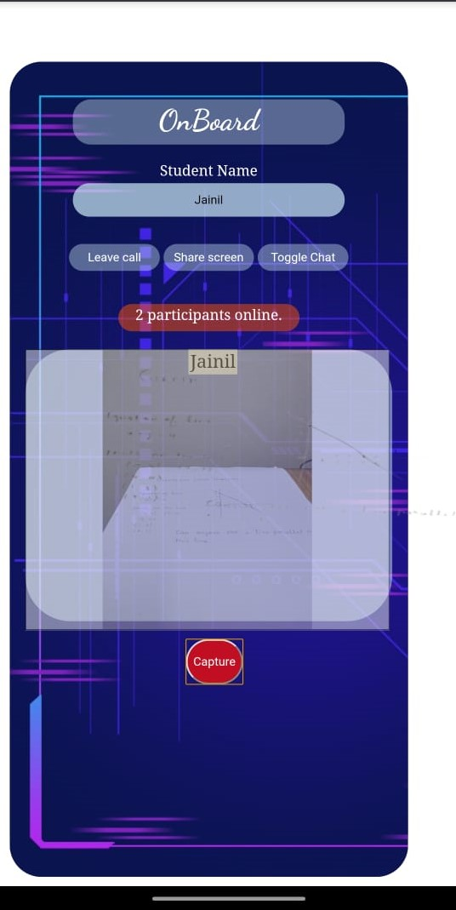
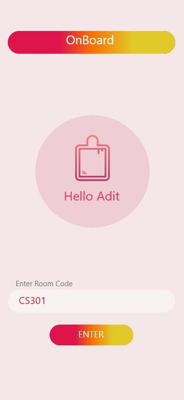
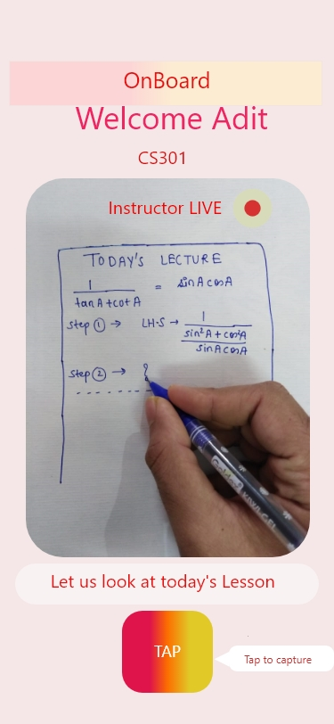
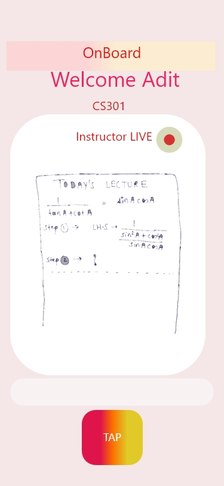
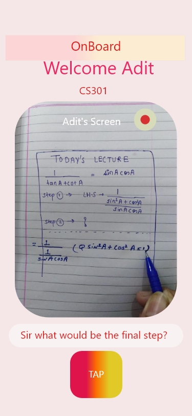
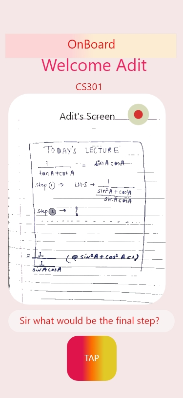

<div align="center" ><h1> ONBOARD </h1></div>

## Introduction
Education in rural areas has never seen a leverage in teaching styles.
Lack of Good Teachers and old teaching methods made it even worse in the pandemic.
Skilled teachers have loction barriers and theey do hasitate to reach the rural areas.
Everybody carries a mobile phone, in rural as well as urban areas.However urban students have access to Tablets , 
where they can easily communicate their problems to the teacher  through JamBoards and teachers can also solve their problems.
The major drawback is for rural area students, where it gets difficult for them to understand the content as it is always a one-way communication.
Teacher shows slides and students watches them.
A student can't learn A,B,C,D just by watching, thus it's necessary for them to come on Board and explain where they are facing difficulty without any Tablets and all.
So our system works like this,
While streaming one has a capture button, that will binarise the image.
This will send a binarized image to all users who open same URL using websocket.
We will try to make the background transparent and display camera image under the binarized image.
Now a student can project the outlines on a piece of paper and himself do some changes in the image and send the overlaid image back.
This will work turn by turn and a blackboard chat system is formed.More interactive and more encouraging.

This would be hard to implement completly, but can be given a good try.

## Front End
We have used HTML, CSS, and Javascript for frontend part.

## Back End
We have used Flask for backend.

## Setup/Installation

1. [Create a Twilio account](https://www.twilio.com) (if you don't have one yet). It's free!


2. [Generate an API Key](https://www.twilio.com/console/project/api-keys) for your account.

3. Now, set the directory path where you want to clone and also the directory where you will write solutions

```sh
cd INSTALLATION_PATH 
```
4.  Clone this repository `git clone https://github.com/Abhinav1299/hackiiitv20-submissions/tree/team%2320`
or you can download and extact the zip file.

5. Move to the project directory
```sh
cd team#20-5
```
6. Copy paste the API Keys from your twillio account after making a copy of .env.template
```sh
cp .env.template .env
```
7. Create a virtual environment
```sh
pip install virtualenv
virtualenv venv
```
- Activate virtual environment (macOS or Linux)
```sh
source venv/Scripts/activate
```
- Activate virtual environment (Windows)

```sh
venv\Scripts\activate 
```
8. Installing requirements
```sh
pip install -r requirements.txt
```

9. Starting the backend server
```sh
python app.py 
```
10. Making a public server using ngrok
- Open another terminal for creating public server
- Move to the project directory 
- Create virtual environment as above
- start the server which will act as a public server for localhost 5000 


```sh
ngrok http 5000
```

## Working

There is a mentor which starts the server and creates a public URL for it. This URL is shared among the students, and the students join. The public URL works as a room where all participants can see the screen of mentor. As an example, in the below section of snapshots, the first image shows the screen of mentor. The mentor then clicks the capture button on the application. A snapshot of present screen is taken and the background is removed. Then this image is imprinted on the on going video stream of mentor, which is visible to all. Then, if any student have a doubt in any step or want to draw anything on his/her notebook and share with the mentor, the capture button is clicked on the student side and same process happens again. 


## Snapshots of our working application

<!--  -->


&emsp;  &emsp;  
 &emsp;  &emsp; 


## Snapshots of our prototype

&emsp;  &emsp;  &emsp;  &emsp; &emsp;  &emsp; &emsp;  &emsp; 


## Team Members

* Jainil Shah
* Adit Alware
* Abhinav Gupta
* Harish Suthar
