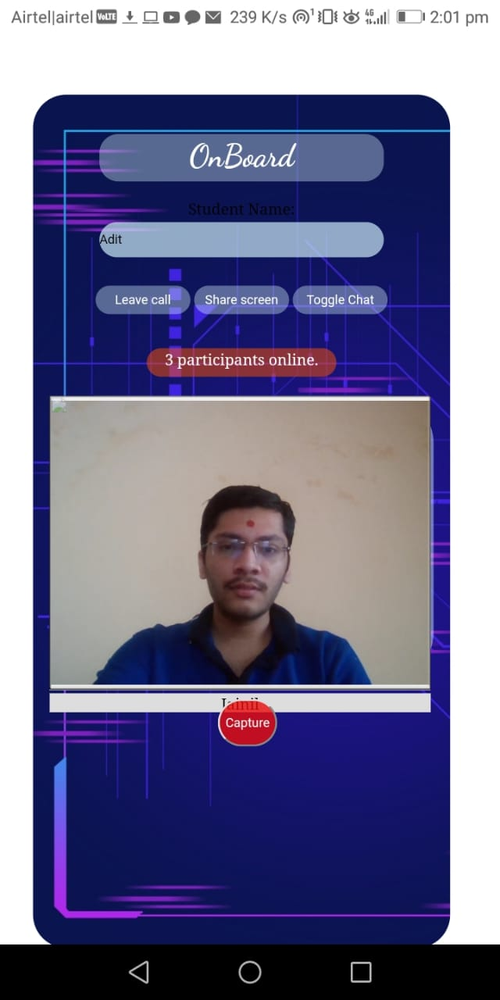
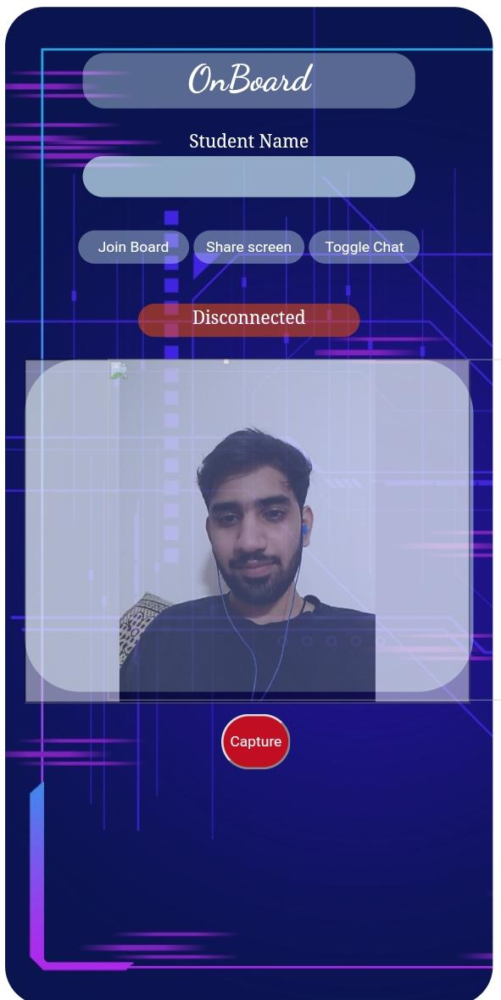
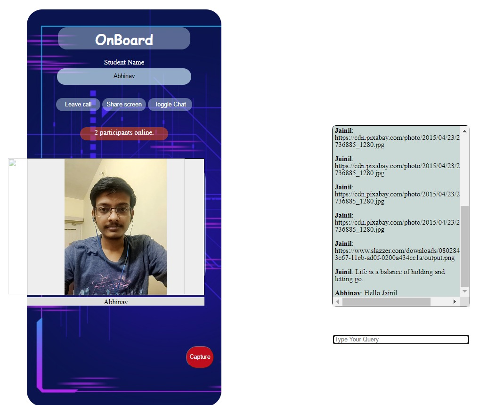

<h1> ONBOARD </h1>

## Introduction
Education in rural areas has never seen a leverage in teaching styles.
Lack of Good Teachers and old teaching methods made it even worse in the pandemic.
Skilled teachers have loction barriers and theey do hasitate to reach the rural areas.
Everybody carries a mobile phone, in rural as well as urban areas.However urban students have access to Tablets , 
where they can easily communicate their problems to the teacher  through JamBoards and teachers can also solve their problems.
The major drawback is for rural area students, where it gets difficult for them to understand the content as it is always a one-way communication.
Teacher shows slides and students watches them.
A student can't learn A,B,C,D just by watching, thus it's necessary for them to come on Board and explain where they are facing difficulty without any Tablets and all.
So our system works like this,
While streaming one has a capture button, that will binarise the image.
This will send a binarized image to all users who open same URL using websocket.
We will try to make the background transparent and display camera image under the binarized image.
Now a student can project the outlines on a piece of paper and himself do some changes in the image and send the overlaid image back.
This will work turn by turn and a blackboard chat system is formed.More interactive and more encouraging.

This would be hard to implement completly, but can be given a good try.

## Snapshots of our working application

<!--  -->

&emsp;  &emsp;  &emsp;  &emsp; 

## Snapshots of our prototpye

&emsp;  &emsp;  &emsp;  &emsp; &emsp;  &emsp; &emsp;  &emsp; 

## Team Members

* Jainil Shah
* Adit Alware
* Abhinav Gupta
* Harish Suthar
